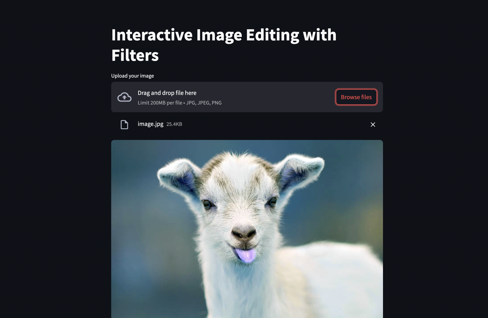

# 📸 Photo Editor - OpenCV + Streamlit

A lightweight, browser-based image editing app built using **OpenCV** for backend processing and **Streamlit** for an intuitive frontend. This tool allows users to apply filters, perform transformations like rotation, cropping, brightness adjustment, and download the edited image – all in real-time.

---

## 🚀 Features

- ✅ Upload local image files via drag & drop
- 🎨 Apply real-time aesthetic filters:
  - Grayscale
  - Sepia
  - Negative
  - Gaussian Blur (with intensity slider)
  - Edge Detection
- ✂️ Transformations:
  - Crop (manual coordinates - to be expanded in future)
  - Resize
  - Rotate (with real-time slider)
  - Flip (horizontal/vertical)
  - Brightness & Contrast adjustment
- 🖼️ Live image preview
- 📥 Download the edited image

---

## 📷 Demo



- Original upload vs edited preview
- Demonstrating filters and sliders
- Final image download interface

---

## 🛠️ Tech Stack

| Frontend        | Backend         | Image Processing |
|-----------------|-----------------|------------------|
| Streamlit       | Python | OpenCV          |

---

## 📂 Project Structure

```bash
photo_editor_backend/
├── filters.py       # Handles aesthetic filters like grayscale, sepia, etc.
├── transform.py     # Image transformations: crop, resize, rotate, brightness
├── utils.py         # Image loading/saving
├── main.py          # Test runner for backend functions
├── app.py           # Streamlit frontend
├── requirements.txt # All dependencies
├── runtime.txt      # Python version (for deployment platforms like Heroku)
├── test_images/     # Sample input/output images
└── README.md        # You're reading it!
